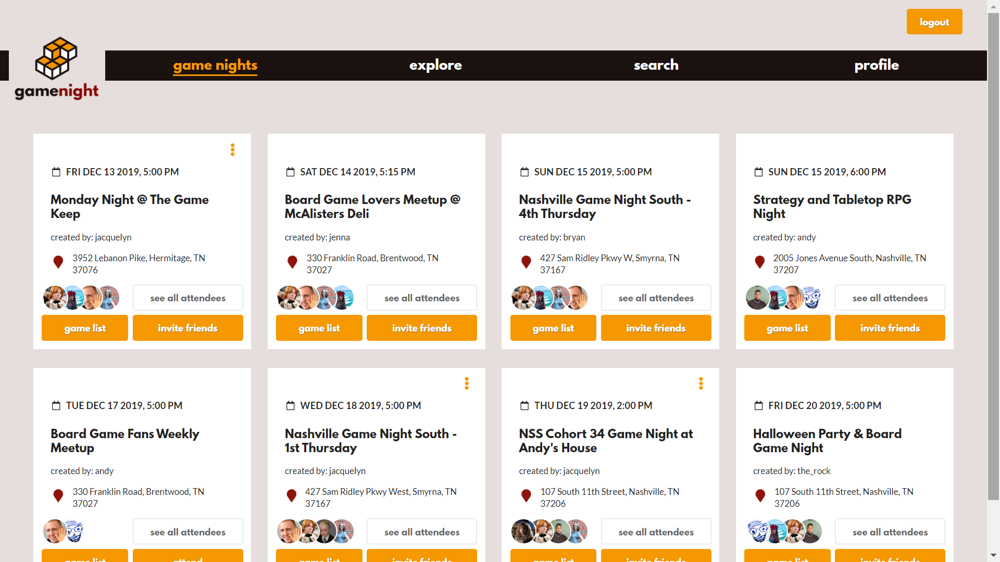
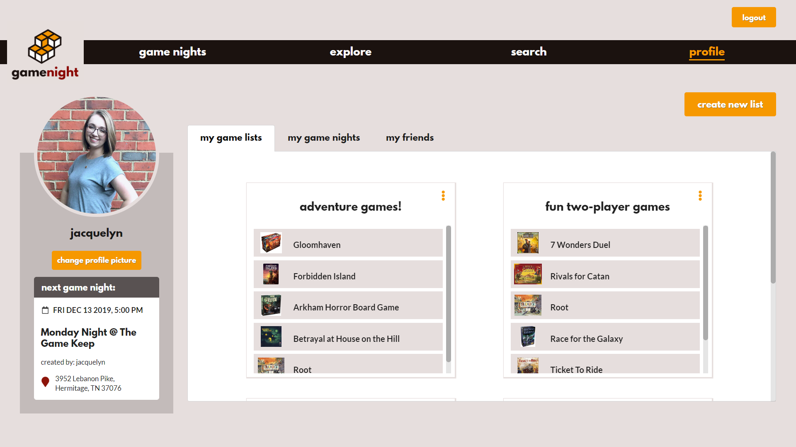

## Welcome to Game Night!
Game Night is a single-page CRUD app built with React and Semantic UI that brings people together to play board games. It lets users keep track of favorite games and discover new games by searching an open-source API from within the app. It shows all future game night meetups and the games that will be played. Users are routed to different views with React Router DOM. Firebase stores user-added profile pictures, while a flat data structure in JSON server stores the data for the app.

## Preview

